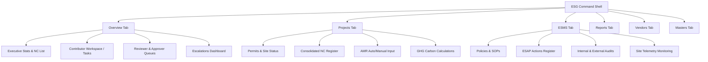

# Business Requirements Document (BRD)
## Project Voltline — Environmental, Social, & Governance (ESG) Command Module

**Document Version:** 1.0.0  
**Date:** August 13, 2026  
**Author:** Antigravity (AI Coding & Design Intelligence Partner)  
**Status:** Approved / Core Reference Document  

---

## 1. Document Purpose & Objectives

This document defines the comprehensive business, operational, functional, and data requirements for the **Environmental, Social, & Governance (ESG) Command Module** within the **Voltline EV Fleet Intelligence** platform. 

The primary goals are to:
- Establish a single source of truth for the ESG system boundaries, user roles, and compliance workflows.
- Detail the multi-tiered tracking mechanisms (permits, policies, site monitoring, vendor verification, audits, and training).
- Formalize the data dictionary and schemas supporting greenhouse gas (GHG) reporting, annual monitoring reports (AMR), and business responsibility reporting (BRSR).
- Outline the automatic SLA escalation matrices and audit trail configurations.
- Align the user experience with modern design systems and visual standards.

---

## 2. Project Background & Business Goals

As EV fleet operations scale across multiple regional depots, maintaining rigorous compliance with local, national, and international ESG standards becomes critical. Transvolt Mobility operates electric buses and high-power charging infrastructure, subject to environmental approvals, safety regulations, and labor guidelines.

The **ESG Command Module** acts as an operational control center and audit defense shield. It replaces manual, error-prone spreadsheets with an integrated, continuous compliance capturing engine that prepares reports on-demand and manages critical renewals proactively.

### Core Business Objectives:
1. **Prevent Regulatory Violations:** Avoid operational shutdowns or legal penalties by tracking legal permits (Consent to Establish/Operate) and triggering early warnings before expiration.
2. **Streamline Audits and Disclosures:** Provide lenders (e.g., development finance institutions) and boards with instant access to audited ESG parameters, GHG footprints, and policies.
3. **Institutionalize Accountability:** Assign clear ownership for data entries and audits, and enforce SLAs through automated multi-level escalation loops.
4. **Enforce Supply Chain Integrity:** Screen and audit third-party vendors (waste recyclers, charger OEMs, civil works contractors) to prevent downstream liability.

---

## 3. Target User Personas & Role-Based Access Control

The ESG module supports a complex, multi-stakeholder ecosystem. User permissions and views are governed by a strict Role-Based Access Control (RBAC) mapping.

| Role | Key Focus & Responsibility | System Permissions |
| :--- | :--- | :--- |
| **ESG Team / ESG Lead** (`esg_team`) | Overall program execution, carbon calculations, and final report sign-off. | Full access to all tabs (Overview, Projects, ESMS, Reports, Vendors, Masters). |
| **Site / Depot Manager** (`site_manager`) | Enters monthly telemetry (water, diesel) and logs local permit applications. | Read-write on Overview and Projects (Non-Compliance and AMR inputs). Workspace-only view. |
| **Project Manager** (`project_manager`) | Manages depot construction, lifecycle stages, and schedules local ESAP tasks. | Access to Overview, Projects (Permits, Site, NC), and ESMS (ESAP, Lifecycle, Monitoring). |
| **HSE / EHS User** (`hse`) | Logs safety statistics, incident reports, and monitoring breaches. | Access to Overview and Projects (Non-Compliance, AMR safety fields). Workspace-only. |
| **HR / People User** (`hr`) | Enters workforce statistics, local hire ratios, and diversity records. | Access to Overview and Projects (AMR social inputs). Workspace-only. |
| **Energy / Operations User** (`operations`) | Monitors grid utility draw, solar generation, and battery lifecycle data. | Access to Overview and Projects (AMR energy fields, GHG). Workspace-only. |
| **Finance / Accounts User** (`finance`) | Enters electricity expenditures and CSR spending metrics. | Access to Overview and Projects (AMR financial metrics). Workspace-only. |
| **Compliance / Legal User** (`legal`) | Tracks corporate licenses, board diversity, and ESG policies. | Access to Overview, Projects (Permits), and ESMS (Policies, SOPs). Workspace-only. |
| **ESG Reviewer** (`reviewer`) | Performs intermediate validation on submitted indicators and documents. | Access to Overview (Validation Queue) and Projects (NC, AMR). |
| **ESG Approver** (`approver`) | Signs off on reports, policies, and overrides. Authorized to return entries. | Access to Overview (Approval Queue) and Projects (NC, AMR). |
| **ESG Administrator** (`admin`) | Manages master emission factors, glossary terms, and alert thresholds. | Full administrative overrides on all modules. |

---

## 4. Scope Boundaries

### In-Scope:
- **ESG Overview Dashboard (`/esg`):** Executive overview charts (valid vs expiring vs overdue), Non-Compliance age lists, validation/approval queues, and escalation tracking.
- **ESMS Compliance Tab (`/esg?area=esms`):** Multi-tiered portal covering Policies, SOPs, Grievance registers, ESAP/ESMP, assessments (ESDD, ESIA), Site Monitoring parameters, Audits (internal/external), Training logs, and Assurance calendars.
- **Projects Dashboard (`/esg?area=projects`):** Mapped tracking for permits, site compliance, Non-Compliance registers, Annual Monitoring Reports (AMR), and Greenhouse Gas (GHG) Scope 1/2/3 calculations.
- **Vendor ESG Directory (`/esg?area=vendors`):** Contractor category verification trackers (ISO 14001, labor rules, licenses).
- **Master Data Panel (`/esg?area=masters`):** Interface for configuring alert lead days, GHG emission factors, glossary terms, and user-role emulation.
- **Workflow State Engine:** Verification trails, return-for-correction dialogs, and automated SLA alerts.

### Out-of-Scope:
- Integration with external ERP platforms or direct automated utility billing platforms (data is simulated via JSON stubs/local storage).
- Real-time IoT physical sensors (ambient air meters, water quality flow meters); all data is entered via standard telemetry forms or mock API gateways.

---

## 5. Functional Requirements by Interface Tab



### 5.1 Overview Tab (`area=overview`)
The primary launchpad for the module. It adapts to the user's role:

1. **Executive View (ESG Team, Admin, Executives):**
   - **Compliance State Widgets:** Summarizes compliance items in three states: **Valid**, **Expiring (within lead window)**, and **Overdue**. Color-coded indicators highlight the worst-performing depot or license.
   - **Risk Score Cards:** Renders critical warnings if alert levels rise.
   - **Summary Timelines:** Shows upcoming assurance tasks and expiring legal documents.

2. **Contributor Workspace (Site Managers, HSE, HR, Finance, Operations):**
   - **My Workspace Task Queue:** Displays a filtered list of indicators assigned to the user for data entry.
   - **Status Badging:** Visualizes the reporting state for each metric: `Pending Entry`, `Draft` (saved locally), `Submitted` (sent to reviewer), `Reviewed` (passed to approver), `Returned` (rejected with notes), and `Approved` (finalized).
   - **Quick Action Forms:** Inline triggers to open data entry sheets for the active reporting period.

3. **Approvals and Validation Queue (Reviewers, Approvers):**
   - **Reviewer Panel:** Displays pending submissions. The reviewer can select items, verify supporting calculations, and mark them as `Reviewed` to pass to the approver.
   - **Approver Panel:** Displays reviewed items awaiting final signature. The approver can sign off, changing the status to `Approved`.
   - **Return for Correction Dialog:** Allows reviewers and approvers to return a submission to the contributor. It forces the reviewer to enter a detailed rejection reason, logs the return in the audit trail, and marks the status as `Returned`.

4. **Escalations Dashboard:**
   - Feeds live alerts triggered by automated SLA breaches (e.g., missing metrics entry after the 10th of the month, delayed reviews, or expired permits). Displays the escalation level (Level 0 to 4), who currently owns the task, and who it has been escalated to.

---

### 5.2 Projects Tab (`area=projects`)
Tracks ESG data entry and environmental footprints across operational locations.

1. **Permits & Site Compliance Register:**
   - Lists active permits (e.g., CTE, CTO, Fire NOC, Hazardous Waste Licence) for each site.
   - Tracks ref numbers, authority, issue date, expiry date, owner, and status.
   - Connects to the lead-time configuration in Masters to trigger alerts.

2. **Consolidated Non-Compliance (NC) Register:**
   - **Normalized Aggregator:** Gathers non-compliance items from **four distinct sources** into a single table:
     1. Overdue compliance records (expired permits or license renewals).
     2. Non-conformities (`nc` result) raised during Internal Audits.
     3. Non-conformities raised during External Audits.
     4. Ambient monitoring parameter breaches (e.g., noise levels or air particulates exceeding statutory limits).
   - **Age-Based Risk Sorting:** Items are sorted by duration open (`ageDays` = days since expiry or finding creation date). Open issues stay at the top; closed issues sink to the bottom.
   - **Backlink Integration:** Each NC item features an "Open in Context" action that navigates directly to the original compliance record drawer or audit tab.
   - **External Audience Redaction:** To support external investor reporting, any non-compliance details are marked as "Withheld from External View" by default. The ESG Team can manually toggle disclosure permissions per item.

3. **Annual Monitoring Report (AMR) Input Capture:**
   - **Lender-Configured Fields:** Renders parameters mapped to reporting grids (e.g., energy consumption, local hire ratio, safety hours).
   - **Provenance Chips:** Auto-fetched values (e.g., grid utility meters fetched via API) are locked for standard editing but show a detailed provenance chip indicating the API gateway path and fetch timestamp. Users can flag or challenge the auto-fetched values to trigger a manual override review.
   - **Manual Inputs:** Input boxes with validation styling for site-specific metrics.

4. **Greenhouse Gas (GHG) Carbon Accounting:**
   - Calculates Scope 1 (Direct Fuel), Scope 2 (Purchased Electricity), and Scope 3 (Value Chain Water/Waste) emissions.
   - **Formula Engine:** Computes emissions dynamically using emission factors configured in the Masters Tab ($Emission = Quantity \times Emission\ Factor$).
   - Displays real-time bar charts and breakdown comparisons comparing Scope footprints.

---

### 5.3 ESMS Tab (`area=esms`)
Manages the company's Environmental and Social Management System, structured across 5 core compliance groups.

1. **Governance Group:**
   - **Policies:** Tracks board-approved policies. Stores multiple version blocks, ownership roles, and annual review timelines.
   - **SOPs:** Register of operational standard procedures.
   - **Grievance Register:** Unified registry for logging community and worker grievances. Tracks date, classification, severity, status, action taken, and resolution days.
   - **ESAP/ESMP Register:** The Environmental and Social Action Plan. Aggregates corrective actions, milestones, responsible roles, and due dates. Indicates whether actions are linked to audit findings or policy gaps.

2. **Assessment Group:**
   - Tracks **ESDD** (Environmental and Social Due Diligence) and **ESIA** (Environmental and Social Impact Assessment) checklists, reports, external consultants, and open findings.

3. **Site Monitoring Group:**
   - Tracks monthly environmental readings (PM2.5, PM10, Noise, pH, TDS) against standard statutory limits. Highlights breaches in amber/red.

4. **Assurance Group:**
   - **Audits (Internal & External):** Manages audit schedules, audit teams, scopes, and checklists.
   - **Finding Log:** Tracks findings classified as `Compliant`, `Observation`, or `NC`. Supports an action launcher that spawns a corrective action directly into the ESAP register.
   - **Training Tracker:** Logs safety and EHS training sessions, subjects (e.g., battery handling, emergency response), trainers, attendees, and hours.
   - **Assurance Calendar:** Synchronizes regulatory filing timelines, audit slots, and compliance check-ins.

5. **Lifecycle Group:**
   - Tracks depots through 12 progressive lifecycle stages (from *Land Acquisition* to *COD & Operations*). Displays a milestone progress grid and flags stages that are "stuck" (exceeding 21 days without update).

---

### 5.4 Reports Tab (`area=reports`)
Generates formal ESG and compliance outputs.

1. **Report Definition Registry:**
   - Supported reports: Non-Compliance Report, Annual Monitoring Report (AMR), GHG Carbon Ledger, and ESDD Assessment Summary.
2. **Drafting and Sign-Off Workflow:**
   - Guides reports through three stages: `Draft` (compiling), `Under Review` (reviewer validation), and `Approved` (e.g., signed off by ESG Lead and ready for external export).
3. **Audience Lens Toggle:**
   - Enforces the **External vs Internal** filtering rule. In the "External" view, any non-disclosed non-compliance details or internal observations are filtered out.
4. **Excel Export Engine:**
   - Generates and downloads native `.xlsx` files structured for lenders (includes metadata worksheets, telemetry values, and calculation formulas).
5. **Uploaded Reports Register:**
   - A drag-and-drop filing cabinet for archiving external third-party certificates, environmental clearance letters, and auditor signature sheets.

---

### 5.5 Vendors Tab (`area=vendors`)
Tracks ESG compliance of supply-chain partners.

1. **Vendor Categories:**
   - Maps vendors to specific groups: Waste Recyclers, Charger OEMs, Civil Contractors, and Solar PV Installers.
2. **Document Checklists:**
   - Enforces specific compliance rules per category:
     - *Waste Recyclers:* E-waste Recycler License, ISO 14001, Safety Plan.
     - *Charger OEMs:* ISO 9001, Labour Policy, Safety Plan.
     - *Civil Contractors:* Labour License, Insurance, Safety Plan.
     - *Solar Installers:* Solar Safety Certificate, Quality Plan.
3. **Quarantine & Verification Status:**
   - Uploaded vendor files land in a "Submitted" quarantine status. Administrators verify each document against regulatory criteria, marking them `Verified` or `Rejected` with reasons.

---

### 5.6 Masters Tab (`area=masters`)
The administrative command panel.

1. **Alert Threshold Configurations:**
   - Allows admins to configure custom lead-time windows in days for specific compliance categories. For example, setting Consent to Operate (CTO) lead-time to 90 days triggers warning status 3 months before physical expiry.
2. **GHG Emission Factors Table:**
   - Master list of conversion factors (e.g., Grid Power CO₂ coefficient, Diesel burn factor).
   - **Audit Notes for Changes:** Enforces that any manual factor change requires a detailed verification note detailing the source (e.g., "CEA User Manual v12") and the admin's name, preventing silent carbon accounting tampering.
3. **Glossary & Acronyms:**
   - Central dictionary mapping abbreviations (ESMS, CTE, CTO, DEFRA) to full titles. Powered by acronym inline highlights across the application.

---

## 6. Data Dictionary & Schemas

The following schemas represent the unified data objects utilized across ESG workflows:

### 6.1 `ComplianceRecord` (Permits & Site Compliance)
*   `id` (string): Unique identifier.
*   `typeKey` (string): Mapping key to the Master Compliance types (e.g., `cto`, `cte`, `fire_noc`).
*   `refNo` (string): Registration or license number.
*   `authority` (string): Issuing government body (e.g., State Pollution Control Board).
*   `expiryDate` (string, ISO Date): Expiration date.
*   `ownerId` (string): Employee ID responsible for renewal.
*   `renewal` (string): Status of renewal cycle (`none`, `initiated`, `submitted`, `verified`).
*   `withheldExternal` (boolean): Redaction flag for investor views.
*   `remarks` (string, optional): Detailed notes.

### 6.2 `EsapAction` (Environmental & Social Actions)
*   `id` (string): Unique identifier.
*   `source` (object): Link to the origin:
    *   `kind` (string): `internal-audit`, `external-audit`, `policy-gap`, or `assessment`.
    *   `id` (string): Source item ID.
*   `finding` (string): Description of the finding or gap that prompted this action.
*   `action` (string): Corrective action to be taken.
*   `ownerId` (string): Responsible role or employee.
*   `due` (string, ISO Date): Deadline.
*   `status` (string): Progress state (`open`, `in-progress`, `closed`).
*   `ncRef` (string, optional): Linked Non-Compliance reference.
*   `severity` (string): Severity level (`major`, `minor`).

### 6.3 `Audit` (Internal & External Audits)
*   `id` (string): Unique identifier.
*   `kind` (string): `internal` or `external`.
*   `title` (string): Audit title (e.g., "Annual EHS Audit").
*   `entityId` (string): Associated company entity.
*   `depotId` (string, optional): Associated depot.
*   `status` (string): `planned`, `in-progress`, `completed`.
*   `conductedOn` (string, ISO Date): Completion date.
*   `auditorName` (string): Lead auditor.
*   `auditorOrg` (string, optional): Auditor's firm or department.

### 6.4 `AuditFinding` (Audit Findings)
*   `id` (string): Unique identifier.
*   `auditId` (string): Linked audit.
*   `clause` (string): Standard clause reference (e.g., "IFC PS 2.1").
*   `area` (string): Operational area (e.g., "Waste storage labelling").
*   `result` (string): Compliance result (`compliant`, `observation`, `nc`).
*   `severity` (string, optional): Severity if NC (`major`, `minor`).
*   `actionId` (string, optional): Linked `EsapAction` ID.
*   `remarks` (string): Observations by the auditor.

### 6.5 `MonitoringReading` (Environmental Telemetry)
*   `entityId` (string): Associated entity.
*   `depotId` (string): Associated depot.
*   `paramKey` (string): Mapped monitoring parameter (e.g., `pm10`, `noise_day`).
*   `period` (string, YYYY-MM): Reporting month.
*   `value` (number): Observed reading.

---

## 7. Business Rules, Metrics & Algorithms

### 7.1 Automatic SLA Escalation Matrix
To enforce timely data entry and document renewals, the system runs an automatic daily SLA checker on all open/pending compliance tasks, assigning levels based on days overdue:

```
[SLA Breach Trigger] ---> (Level 1: Overdue - 1 Day) ---> Escalated to Project Manager
                     ---> (Level 2: Escalated - 3 Days) ---> Escalated to ESG Team
                     ---> (Level 3: Critical - 7 Days) ---> Escalated to ESG Head / Approver
                     ---> (Level 4: Critical - 10+ Days) ---> Escalated to Management Board
```

- **Level 0 (SLA Day +0):** Standard assignment. Managed by the *Responsible User*.
- **Level 1 (SLA Day +1):** Alert marked as *Overdue*. Escalated to the *Project Manager*.
- **Level 2 (SLA Day +3):** Alert marked as *Escalated*. Escalated to the *ESG Team*.
- **Level 3 (SLA Day +7):** Alert marked as *Critical*. Elevated to the *ESG Head / Authorized Approver*.
- **Level 4 (SLA Day +10):** Alert marked as *Management Visibility*. Surface directly on Executive dashboards and board notifications.

### 7.2 Non-Compliance (NC) Classification & Aging
- **Major NC:** Triggered when ambient monitoring breaches exceed statutory limits by $> 50\%$ (e.g., `value > limit * 1.5`), or when a legal permit has expired for $> 10$ days without renewal initiation.
- **Minor NC:** Standard regulatory deviations, audit findings marked `minor`, or monitoring breaches under the $1.5\times$ threshold.
- **Aging Formula:** $Age\ (Days) = Current\ Date - Raised\ Date$. Open NCs increase in age daily, driving the overall ESG module risk metrics.

### 7.3 GHG Emissions Calculation Rules
- **Scope 1 (Direct):** $Emissions\ (kg\ CO_2e) = Diesel\ (L) \times 2.68$.
- **Scope 2 (Indirect):** $Emissions\ (kg\ CO_2e) = Grid\ Power\ (kWh) \times 0.82 - Solar\ Generation\ (kWh) \times 0.82$.
- **Scope 3 (Value Chain):** $Emissions\ (kg\ CO_2e) = Water\ Consumption\ (kL) \times 0.34$.
- **Carbon Offsetting Net Score:** $Net\ Emissions = Scope\ 1 + Scope\ 2 + Scope\ 3 - Solar\ Generation\ (kWh) \times 0.82$.

### 7.4 Document State Transitions and Audit Logging
Every status change (e.g., when a user saves a draft, submits a report, or returns a task) must write an immutable entry to the local audit trail:
- **State Flow:** `Pending Entry` $\rightarrow$ `Draft` $\rightarrow$ `Submitted` $\rightarrow$ `Reviewed` $\rightarrow$ `Approved`.
- **Return Loop:** Any reviewer or approver reject command transitions status back to `Returned` (treated as overdue if past the reporting deadline) and forces a `returnReason` entry.
- **Log fields captured:** `User Email`, `Role Config Label`, `Target Depot/Site`, `Record Name`, `Action Triggered`, `Previous Status`, `New Status`, `Rejection Reason (if returned)`, and `Timestamp`.

---

## 8. UX/UI & Visual Standards

The ESG module is built to meet premium enterprise design standards, adopting a glassmorphic look suitable for diagnostic command rooms.

### 8.1 Color Strategy and Accents (60-30-10 Rule)
- **Dominant Canvas (60%):** Slate dark shades (`oklch(0.13 0.014 255)`) or light gray-blues (`oklch(0.982 0.006 250)`).
- **Secondary Surfaces (30%):** Translucent card components (`oklch(0.17 0.016 255)` / `oklch(1 0.002 250)`) with subtle borders (`border-border/40`).
- **Interactive Accents (10%):** Primary teal-blue (`oklch(0.52 0.17 195)`) for tabs, focus elements, and high-priority call-to-actions.
- **Status Indicators:**
  - **Success (Compliant/Valid):** Emerald green (`oklch(0.72 0.15 140)`)
  - **Warning (Expiring/Observation):** Amber yellow (`oklch(0.79 0.15 75)`)
  - **Destructive (Overdue/NC/Critical):** Crimson red (`oklch(0.57 0.2 25)`)

### 8.2 Custom Primitives
- **`LivePulse`:** Mini-ping animation indicating live data capture.
- **`SeverityDot`:** A compact, status-colored dot showing compliance health.
- **`RiskPill` & `DeltaBadge`:** Layered pill containers indicating percentage performance swings.
- **`GlassPanel`:** Card styling featuring border-overlays and backdrop blur.

---

## 9. Non-Functional Requirements

### 9.1 Performance (Doherty Threshold)
- Filter modifications, scope updates, and navigation tabs must redraw in under **400ms**.
- Report exports and calculations should execute asynchronously with immediate skeleton loaders.

### 9.2 Accessibility (WCAG 2.2 Level AA)
- Text-to-background contrast must maintain a minimum ratio of **4.5:1** (checked across light and dark modes).
- Strict keyboard tab indexes for forms, tables, and dialog overlays.

### 9.3 Security & Data Isolation
- Standard users are locked out of the Masters configurations.
- Supply chain onboarding files must be quarantined before validation review.

---

## 10. Assumptions & System Dependencies

1. **Lender Directives:** It is assumed that lenders review ESG parameters based on standard compliance checklists mapped to SEBI BRSR and IFC Performance Standards.
2. **Third-Party Telemetry:** Data accuracy of auto-fetched fields depends on upstream utility API responses; manual overrides serve as fallback mechanisms.
3. **Local Clock Synchronization:** SLA triggers are evaluated against the current application time (`2026-07-15T09:00:00+05:30` set as baseline `ESG_TODAY` for simulation).
